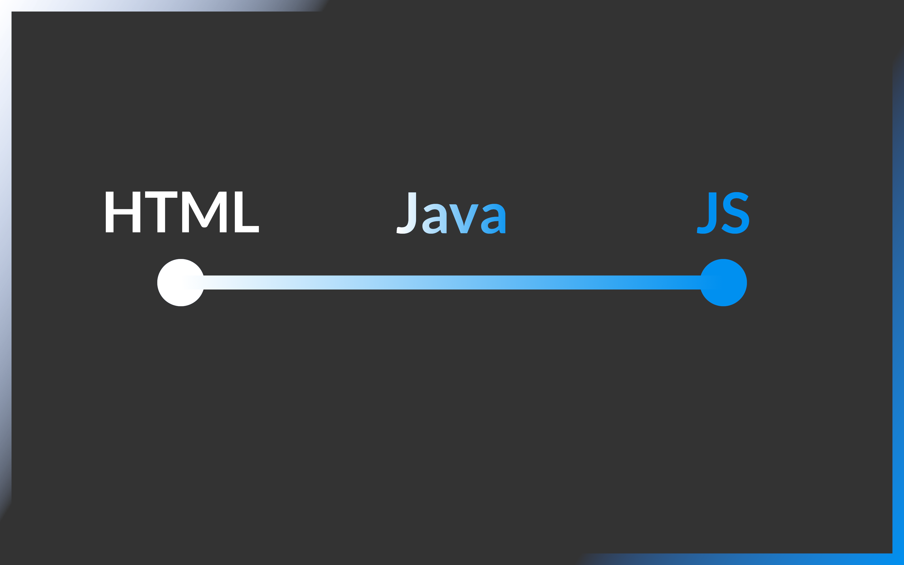
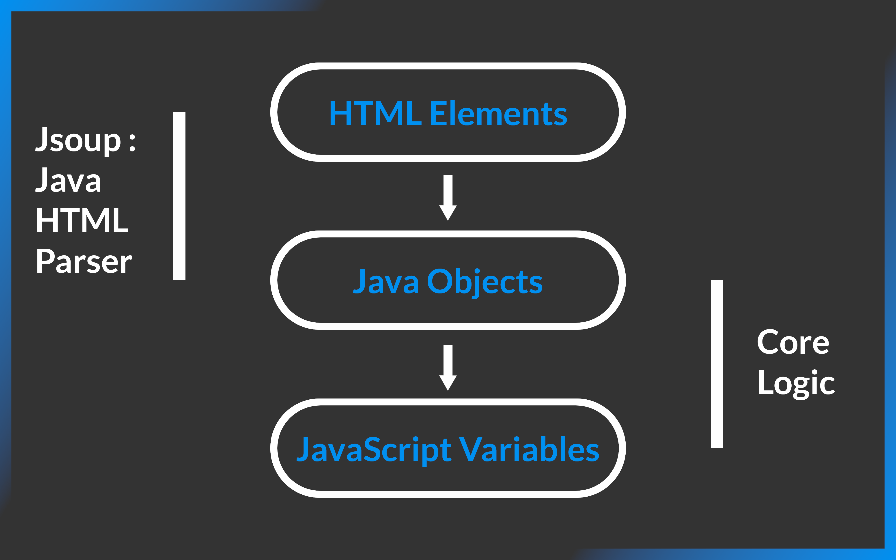

[](https://codecov.io/gh/osscameroon/js-generator)
[](https://opensource.org/licenses/MIT)
[](https://github.com/osscameroon/js-generator/graphs/contributors)


# Table of Contents
- [About](#about)
- [Getting Started](#getting-started)
- [Clients](#clients)
- [Stack](#stack)
- [Contribute](#contribute)



# About

Translating from HTML to JS.

> This project is different from the
> [JavaScript Generator Object](https://developer.mozilla.org/en-US/docs/Web/JavaScript/Reference/Global_Objects/Generator).
 
The goal is to generate JS  from HTML  following the [Document Object Model](https://www.w3schools.com/js/js_htmldom.asp) structure. Sometimes, we forget how to write
JavaScript to build dynamic web apps. Even if we know JS, it happens that we don't always have enough time to generate
JS from a big HTML code. Thus, the goal of this project is helping developers gaining time by producing JS code as
Output based on HTML as Input. This project will be very useful for beginners learning HTML and JavaScript. Also, it
will help more experienced developers whenever they want to use JS instead of HTML.

> We would like to give credit to [jsoup](https://jsoup.org/) /
> [jsoup GitHub Repository](https://github.com/jhy/jsoup/) as the main library to help us handle HTML tokenization and traversing.




## Getting Started

**CLI**

jsgenerator has several options that can be used in a console here is an example of use below

```shell
$ jsgenerator --tty --inline '<div>I am a <strong>tea pot</strong></div>'

let div_000 = document.createElement('div');
let text_000 = document.createTextNode(`I am a `);
div_000.appendChild(text_000);

let strong_000 = document.createElement('strong');
let text_001 = document.createTextNode(`tea pot`);
strong_000.appendChild(text_001);
div_000.appendChild(strong_000);
document.appendChild(div_000);
```

## Clients

**CLI**
```text
Usage: jsgenerator [-htV] [-e=<extension>] [--inline-pattern=<inlinePattern>]
                   [--path-pattern=<pathPattern>]
                   [--stdin-pattern=<stdinPattern>] [-i=<inlineContents>...]...
                   [--] [<paths>...]
Translating files, stdin or inline from HTML to JS
      [<paths>...]        file paths to translate content, parsed as HTML
  -e, --ext=<extension>   output files' extension
  -h, --help              Show this help message and exit.
  -i, --inline=<inlineContents>...
                          args as HTML content, not files
      --inline-pattern=<inlinePattern>
                          Pattern for inline output filename
      --path-pattern=<pathPattern>
                          pattern for path-based output filenames
      --stdin-pattern=<stdinPattern>
                          pattern for stdin output filenames
  -t, --tty               output to stdin, not files
  -V, --version           Print version information and exit.
```

**WEB**

> ***TODO:** Not yet implemented.*

**DESKTOP**

> ***TODO:** Not yet implemented.*

**CODE API**

> ***TODO:** Not yet implemented.*
> See [Wiki](https://github.com/osscameroon/js-generator/wiki).

# Stack

+ Java 17 (or GraalVM JDK 17, for native CLI client)
+ Maven 3
+ Spring 5.3.22
+ Spring Boot 2.7.3

# Contribute

```shell
# 1. Clone
git clone git@github.com:osscameroon/js-generator.git

# 2. Move to root directory
cd js-generator

# 3. Tests & Build
mvn clean package

# 4. Build Native CLI (Requires GraalVM JDK 11)
./cli-build.sh # if provided, first argument will be the file name (useful for version tagging) 

# 5. Browse through code
# 6. Run CLI with --help and play with it
# 7. Fork the project, build, test, open a pull request
```

All your contributions are welcome!
Do not hesitate to open an issue on this repository and/or create a pull request (PR).
In order to create a PR, just fork first.

Thanks for your commitment, we really appreciate! 
Happy Coding! 😊🎉💯

<div align="center">
    
    
</div>

[Back To The Top](#table-of-contents)
