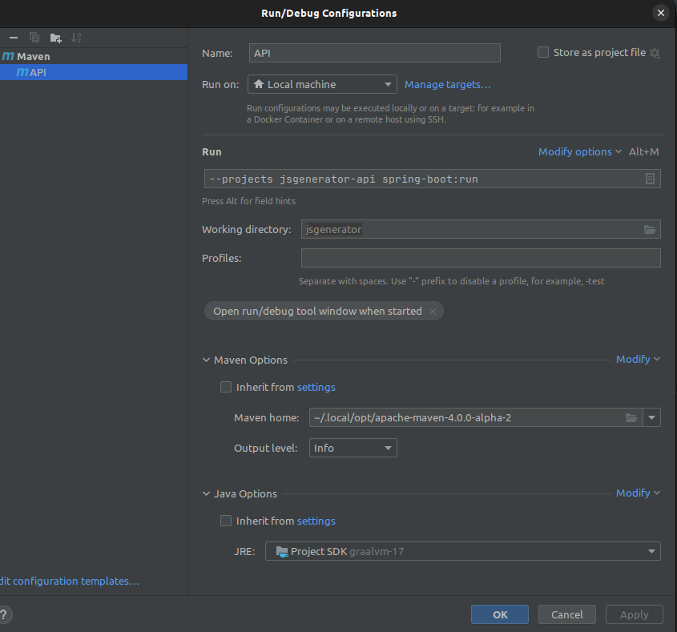

[](https://opensource.org/licenses/MIT)
[](https://github.com/osscameroon/js-generator/graphs/contributors)


# Status: UNDER DEVELOPMENT

# Table of Contents
- [About](#about)
- [Getting Started](#getting-started)
  - [Requirements](#requirements)
  - [Modules](#modules)
  - [Architecture](#architecture)
  - [Compiling](#compiling)
  - [Running](#running)
  - [Packaging](#packaging)
- [Contribute](#contribute)


# About

Translating from HTML to JS

> This project is different from the
> [JavaScript Generator Object](https://developer.mozilla.org/en-US/docs/Web/JavaScript/Reference/Global_Objects/Generator).
 
The goal is to generate JS  from HTML  following the [Document Object Model](https://www.w3schools.com/js/js_htmldom.asp) structure. Sometimes, we forget how to write
JavaScript to build dynamic web apps. Even if we know JS, it happens that we don't always have enough time to generate
JS from a big HTML code. Thus, the goal of this project is helping developers gaining time by producing JS code as
Output based on HTML as Input. This project will be very useful for beginners learning HTML and JavaScript. Also, it
will help more experienced developers whenever they want to use JS instead of HTML, very useful in applications where we need to add dynamism.

[Sherlock Wisdom](https://github.com/sherlockwisdom) shared why he needed such tool:

> 😂 Yes it's hard to say why it's important. I was working on an Android based app, but was building it with Vanilla JavaScript. So I needed a quick way to turn bootstrap code into Vanilla Js objects so that I could do what ReactJS does now 🤣. This was ~4 years back. Not sure of its relevance now, but they could be some. 😅 Sorry if I rather made things not easy for you to explain.

We would like to give credit to [jsoup](https://jsoup.org/) / [jsoup GitHub Repository](https://github.com/jhy/jsoup/) as the main library to help us handle HTML tokenization and traversing.


# Getting Started

## Requirements

+ JDK 17
  > **Because we use modern JavaFX**
  > 
  > **NOTE:** For native build (CLI, for eg.), we use GraalVM with JDK 17.
  >
  > Recent versions of GraalVM are not bundling `native-image` CLI by default.
  > We are required to install is manually, by running:
  > ```shell
  > # Where `gu` is an executable bundled with GraalVM
  > gu install native-image
  > ```
+ Maven 4
  > Because of its unique features over maven 3:
  > namely, multi module dependency resolution under common parent, when running a maven goal only on some child
+ Spring 5.3.22
  > A framework to bootstrap dependency injection and inversion of control for our modules
+ Spring Boot 2.7.3
  > Leverage convention over configuration and autoconfiguration discovery to enforce consistent a behaviour
  > throughout our frontends

## Modules

The project takes advantage of Maven multimodule capabilities to enforce a consistent versioning and releases and,
the specific Maven 4 features to deliver a seamless developer experience.

```text
js-generator:
  |- jsgenerator-api
  |- jsgenerator-web
  |- jsgenerator-cli
  \- jsgenerator-desktop
```

## Architecture

| THE MODULE                         | ITS CONTENT && DEPENDENCIES         | PACKAGING |
|------------------------------------|-------------------------------------|-----------|
| js-generator                       | Bill of Material, global properties | POM       |
| jsgenerator-core                   | Core API, Spring Boot auto-conf     | JAR       |
| jsgenerator-slim-api               | jsgenerator-core, spring-web        | JAR       |
| jsgenerator-slim-cli               | jsgenerator-core, picocli           | JAR       |
| [jsgenerator-api](./README.api.md) | jsgenerator-slim-api                | FAT JAR   |
| [jsgenerator-cli](./README.cli.md) | jsgenerator-slim-cli                | FAT JAR   |

> **NOTE:** FAT JAR packaged modules are mere wrappers around slim modules. The separation is important because then,
> the test modules can use slim JARs as dependencies, unlike FAT JARs. This has to do with how "normal" vs. FAT JARs
> are laid out.

## Compiling

```shell
# Clone the git repository
git clone git@github.com:osscameroon/js-generator.git

# Move at the project root
cd js-generator

# Compile & test all the modules
mvn clean test
```

## Running

> Compiling the whole project before running child modules is advised.
> 
> To set up you IDE runner, follow this IntelliJ example:
> 
> 

API Server
```shell
# After starting the server, visit http://localhost:8080
mvn --also-make --projects jsgenerator-api clean spring-boot:run
```

Command Line Interface (CLI)
```shell
# After reading the help, play out with different CLI options
mvn --also-make --projects jsgenerator-cli clean spring-boot:run -Dspring-boot.run.arguments=--help

# For example:
mvn --also-make --projects :jsgenerator-cli clean spring-boot:run \
  -Dspring-boot.run.arguments="--tty --inline '<div>I am a <strong>tea pot</strong></div>'"
```

## Packaging

```shell
# Will compile all the modules into JAR (or FAT JAR - see the table above)
mvn clean package

# Additionally, build CLI into native executable (require GraalVM - see requirements above)
./cli-build.sh
```

# Contribute

All your contributions are welcome!

Do not hesitate to open an issue on this repository and/or create a pull request (PR).

In order to create a PR, just fork first.

**[We started from the bottom 5 years ago](https://github.com/opensourcecameroon/jsGenerator), now we are here, we believe we will continue moving forward together 😊.** 

Thanks for your commitment, we really appreciate! 
Happy Coding! 😊🎉💯

<div align="center">
    
    
</div>

[Back To The Top](#table-of-contents)
